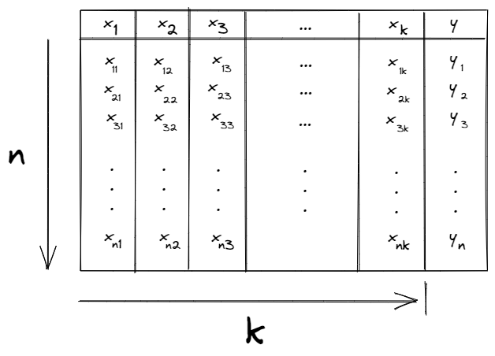

## Problem formulation

We have a tabular data that consists of 𝑛 observations, each observation represents a row in the table of data. Column-wise, the data consists of 𝑘+1 columns. 𝑘 of them are independent variables "features" $𝑥_1$, $𝑥_2$, ..., $𝑥_𝑘$ and the last one is a "response" variable 𝑦 that its values are continous. The following figure, shows an example of how the data looks.

The goal is to use the data at hand to build a model that approximate the relationship between the dependent variable $y$ and the set of the independent variables $X= \{x_{1}, x_{2}, x_{3}, ..., x_{k} \}$.

Multiple linear regression as an extention of the simple Linear regression assumes a linear relationship between the dependent variable $y$ and the set of the independent variables $X$ and in light of this assumption, $y$ could be written as a linear combination of $x_{i}$'s, where $$i = 1,2,3, ..., k$$.

$$
y = \beta_{0} + \beta_{1}x_{1} + \beta_{2}x_{2} + \beta_{3}x_{3} + ... + \beta_{k}x_{k} + \varepsilon
$$

$$
\begin{bmatrix}
y_{1} \\
y_{2} \\
\vdots\\
y_{n}
\end{bmatrix} =
\begin{bmatrix}
1      & x_{11}  & x_{12} & x_{13} & \cdots & x_{1k}\\
1      & x_{21}  & x_{22} & x_{23} & \cdots & x_{2k}\\
\vdots &  \vdots & \vdots & \vdots & \vdots &   \vdots\\
1 & x_{n1} & x_{n2} & x_{n3} & ... & x_{nk}\\
\end{bmatrix} \begin{bmatrix}
\beta_{0}\\
\beta_{1}\\
\beta_{2}\\
\vdots\\
\beta_{k}
\end{bmatrix} + \begin{bmatrix}
\varepsilon_{1}\\
\varepsilon_{2}\\
\vdots\\
\varepsilon_{n}
\end{bmatrix}
$$

$\varepsilon$ is called the irreducable error, because no matter how close the model we build to the true relationship, still there will be a small margin of error.
$$ y = XB + E$$

A fundamental difference between the single version and the multiple version of the linear regression models is, simple linear regression assumes true linearity between $y$ and $x$, modeling a relationship between one independent variable and one dependent variable as a real line $y = mx + c$.  
On the other hand, the linearity in multiple linear regression is only required for the coeffcients $\beta_{i}$'s, $i=1,2,3,...,k$ and the relationship between $y$ and $x_{i}$'s in the set $X$ could be non-linear. The following examples show valid and invalid variants of multiple linear regression models.

- $y = \beta_{0} + \beta_{1}x_{1} + \beta_{2}x_{2} + \beta_{3}x_{3} + \beta_{4}x^{2}_{1}$ ✅
- $y = \beta_{0} + \beta_{1}x_{1} + \beta_{2}x_{2} + \beta_{3}x_{3} + \beta_{4}x_{2}x_{3}$ ✅
- $y = \beta_{0} + \beta^{2}_{1}x_{1} + \beta_{2}x_{2} + \beta_{3}x_{3} + \beta_{4}x_{4}$ ❌
- $y = \beta_{0} + \beta_{1}x_{1} + \beta_{2}x_{2} + \beta_{1}\beta_{2}x_{3} + \beta_{4}x_{3}$ ❌

## Matrix Notation

The erriducable error $\varepsilon$ can not be estimated. Therefore our approximated model will ignore it and we will infer only the values of $\beta_{i}$'s. Our model is going to be in the following form  
$$\hat{y} = \beta_{0} + \beta_{1}x_{1} + \beta_{2}x_{2} + \beta_{3}x_{3} + ... + \beta_{k}x_{k}$$  
Let's say we have already calculated the $\beta_{i}$'s , we can then calculate $\hat{y_{i}}$ for each observation in our data. We can write this approximation in a matrix notation as follows.

$$
\begin{bmatrix}
1 & x_{11} & x_{12} & x_{13} & ... & x_{1k}\\
1 & x_{21} & x_{22} & x_{23} & ... & x_{2k}\\
. &  .     &  .     &    .   & ... &   .   \\
. &  .     &  .     &    .   & ... &   .   \\
. &  .     &  .     &    .   & ... &   .   \\
1 & x_{n1} & x_{n2} & x_{n3} & ... & x_{nk}\\
\end{bmatrix} \begin{bmatrix}
\beta_{0}\\
\beta_{1}\\
\beta_{2}\\
.\\
.\\
.\\
\beta_{k}
\end{bmatrix} = \begin{bmatrix}
\hat{ y_{1} }\\
\hat{ y_{2} }\\
.\\
.\\
.\\
\hat{ y_{n} }
\end{bmatrix}
$$

$$
X\hat{B} = \hat{y}
$$

## Finding the optimal parameters

We want our approximated model to be as close as possible to the true relationship that generated the data. Therefore we want to see that the difference between the observed value of the dependent variable and its approximated value, goes to zero. $y - \hat{y} \rightarrow 0$.

$$
y - \hat{y} = \begin{bmatrix}
y_{1} - \hat{ y_{1} }\\
y_{2} - \hat{ y_{2} }\\
.\\
.\\
.\\
y_{n} - \hat{ y_{n} }
\end{bmatrix} \rightarrow \begin{bmatrix}
0\\
0\\
.\\
.\\
.\\
0\\
\end{bmatrix}
$$

In other form, the overall $\sum_{i=1}^{n} (y_{i} - \hat{y_{i}})^{2} \rightarrow 0$

Since $\hat{y} = X\hat{B}$, we can express $\sum_{i=1}^{n} (y_{i} - \hat{y_{i}})^{2}$ &emsp; as ↴

$$(y_{i} - \hat{y_{i}})^2\ =\ (y - \hat{y})^T(y - \hat{y})$$

$$(y - \hat{y} )^T(y - \hat{y} ) =\ (y - X\hat{B} )^T(y - X\hat{B} )$$

$$ =\ (y^{T} - (X\hat{B})^{T})(y - X\hat{B}) =\ (y^{T} - \hat{B}^{T}X^{T})(y - X\hat{B})$$

$$ = y^{T}y - y^{T}X\hat{B} - \hat{B}^{T}X^{T}y + \hat{B}^{T}X^{T}X\hat{B}$$

$$\large \frac{\partial\ ({(y - X\hat{B})^T(y - X\hat{B})}) }{\partial \hat{B}} = 0$$

$$\large \Rightarrow \quad \frac {\partial\ (y^{T}y\ -\ y^{T}X\hat{B}\ -\ \hat{B}^{T}X^{T}y\ +\ \hat{B}^{T}X^{T}X\hat{B})}{\partial \hat{B}} = 0$$

$$\large \Rightarrow \frac{\partial y^{T}y}{\partial \hat{B}} - \frac{\partial  y^{T}X\hat{B}}{\partial \hat{B}} - \frac{\partial \hat{B}^{T}X^{T}y}{\partial \hat{B}} + \frac{\partial \hat{B}^{T}X^{T}X\hat{B}}{\partial \hat{B}} = 0$$

if we have a matrix $A_{m \times m}$ and a vector $x_{m \times 1}$, then:

$$\large \frac{\partial Ax}{\partial x} = A, \qquad \frac{\partial x^{T}A}{\partial x} = A^{T}, \qquad \frac{\partial x^{T}Ax}{\partial x} = 2A^{T}x$$

$$\large \Rightarrow \qquad \frac{\partial  y^{T}X\hat{B}}{\partial \hat{B}} = y^{T}X$$

$$\large \qquad \quad \frac{\partial \hat{B}^{T}X^{T}y}{\partial \hat{B}} = (X^{T}y)^{T} = y^{T}X$$

$$\large \qquad \quad \frac{\partial \hat{B}^{T}X^{T}X\hat{B}}{\partial \hat{B}} = 2X^{T}X\hat{B}$$

$$\large \qquad \quad \frac{\partial y^{T}y}{\partial \hat{B}} = 0$$

$$\therefore \large \quad -y^{T}X - y^{T}X + 2X^{T}X\hat{B} \quad = \quad 0$$

$$\large \Rightarrow \quad 2X^{T}X\hat{B} \quad = \quad 2y^{T}X$$

$$\large \qquad \boxed{\hat{B} \quad = \quad (X^{T}X)^{-1}y^{T}X}$$
