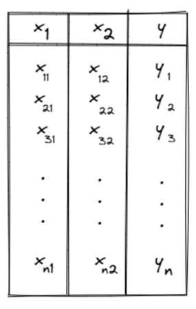
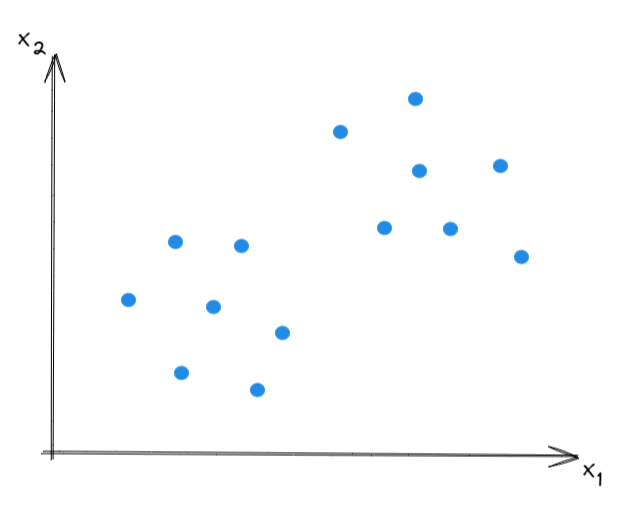
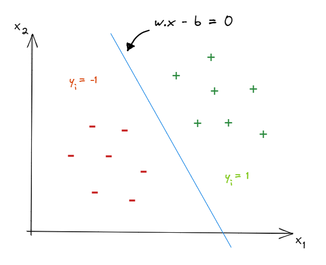
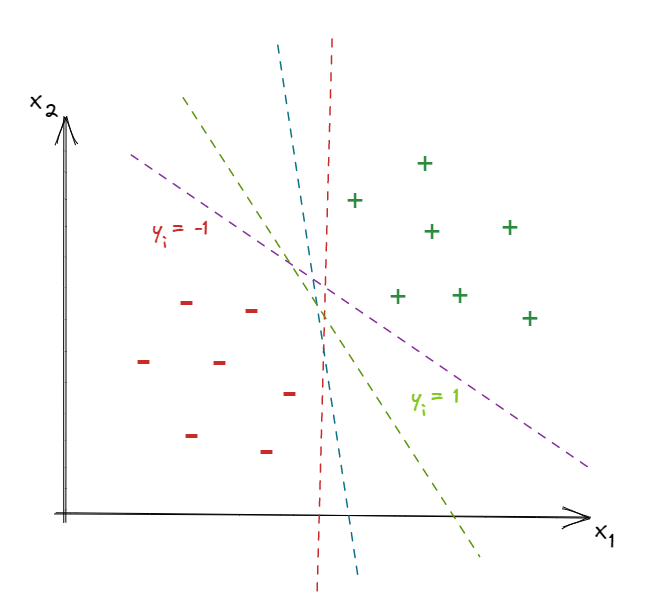
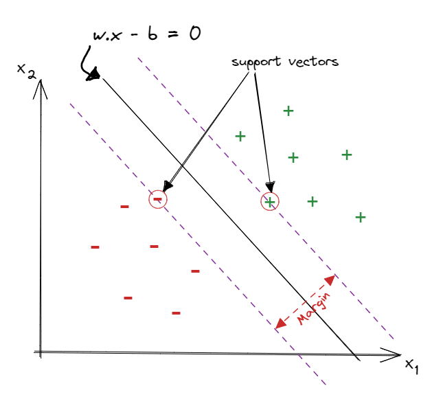
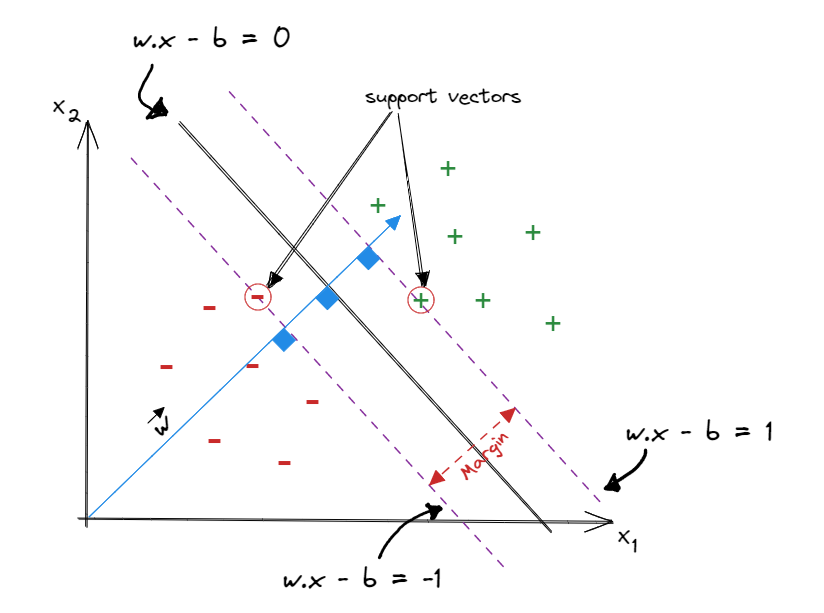
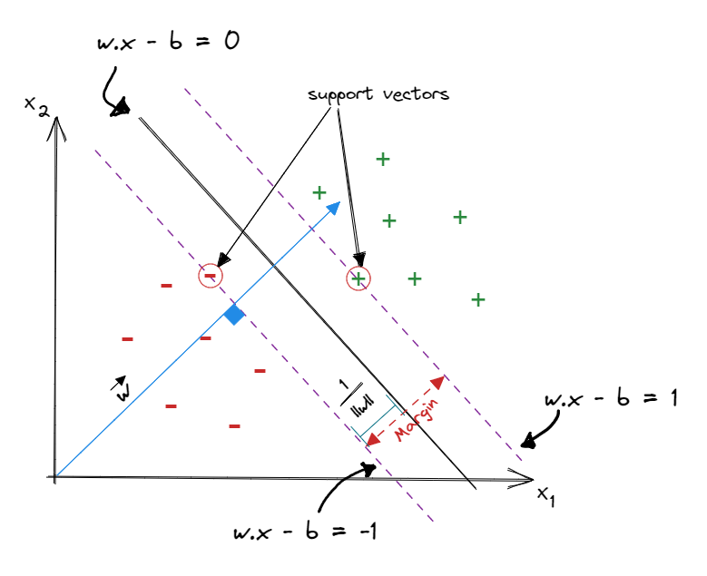

## Introduction

Support Vector Classifier (SVC) is a non-parametric classification algorithm that is based on geometric representation of linearly seperable data. In this article we are going to go through the development of the SVC algorithm step by step. Firstly, Because of the geometric background of SVC, let's start with data that has only 2 features, therefore it can be rerresented in 2D, which makes visualiztion much easier and thereafter all the concepts in 2D will generalize well for higher dimensions.

## The shape of data

Let's say we have tabular data in the following form.

Where each row in the table consists of two components, the first component is a point $$X_{i}$$ in the space $$R^{2}$$ such that $$X_{i} = (x_{i1}, x_{i2})$$ and the second component is the group to which $$X_{i}$$ belongs $$y_{i} \in \{-1, 1\}$$.  
The data when ploted in 2D should be linearly seperable, and it would look something like in the following plot.

## Geometrical Data classification

The goal of SVC is to figure out a line that separate the two groups of data in a **_best way_**. We will elaborate more on how this best way works in the upcoming section.

### Line equation

It is important to note that the line equation used to describe the seperation line that we are after is not the commonly used slope-intercept form ($$y = mx+c$$). The reason is, the slope-intercept form fails to describe the vertical line, which might be a candidate for a seperation line in SVC. Let's take an example.  
$$L_{1}$$ is a vertical line at $$x=a$$, now if we took two points on $$L_{1}$$, $$p_{0}=(a, y_{1})$$ and $$p_{1}=(a, y_{2})$$, then:

$$
m = \frac{y_2-y_1}{a-a} = \frac{y_2-y_1}{0} = \infty
$$

Therefore, we use the general form of line-equation instead, $$Ax + By + C = 0$$ that can describe a verticle line at $$x=a$$ by setting $$A=1$$, $$B=0$$ and $$C=a$$. The general form has another helpful characteristic, it tell if a point fall above or under a line. e.g. if $$L$$ is a line that has the following general form $$a_{1}x+b_{1}y = c_{1}$$ and $$p=(x_{1}, y_{1})$$ is a point, then by plugging $$p$$ in $$L$$ we get a value $$v = a_{1}x_{1}+b_{1}y_{1}-c_{1}$$, $$v > 0$$ means the point $$p$$ is above the line $$L$$, $$v < 0$$ means $$p$$ is below $$L$$, finally, $$v = 0$$ means $$p$$ is on $$L$$.  
Now let's redraw the previous figure, adding a line between the two clusters and label the points in the cluster above the line as (**+**) and the points in the cluster below the line as (**-**). The line could be expressed in a vector notation as $$wx-b=0$$.

### The methodology to choose the best separation line

How to determine the $$w$$ and $$b$$ that result in the best separation line, among many line candidates?

The approach of SVC to choose the best seperation line is to find two parallel lines that each of them goes through at least one edge point of each group, and the best pair of lines is the one that has the largest distance between them "This distance is called **the margin**", then the seperation line is situated in the middle between these two parallel lines and parallel to them. This approach is called **the widest street** approach and the edge points of each clusters that the parallel lines go through are called **support vectors**.

### Margin width formulation

Now we want to formulate the margin width so we can use the assumed formula for maximizing the distance between the two data groups. To get to this point, we go through the following steps.  
1- The line "$$wx-b=0$$" could be written as "$$wx=0$$" by including $$1$$ in the vector $$x$$ and $$-b$$ in the vector $$w$$.

$$
\large
\begin{split}
wx-b =
\begin{bmatrix}
w_{1} & w_{2} & -b
\end{bmatrix}
\begin{bmatrix}
x_{1}\\
x_{2}\\
1\\
\end{bmatrix} = wx = 0
\end{split}
$$

$$wx=0 \Rightarrow \qquad w$$ is perpendicular to $x$

  

Now we can calculate the distance from the line $wx-b=0$ to the line $$wx-b=1$$ or the line $$wx-b=-1$$ as multiples of the unit vector of $$w$$, starting from a point $$x_*$$ on the line $$wx-b=0$$. Let's calculate the distance from the line $$wx-b=0$$ to the line $$wx-b=1$$ and denote this distance as $$k$$. Therefore the corresponding point $$x_+$$ on the line $$wx-b=1$$ is  
$$x_+ = x_* + k \frac{w}{||w||}, \qquad \text{margin}=2k$$

$$\because x_{+}$$ is on $$wx-b=1$$

$$\Rightarrow \qquad w(x_{*} + k \frac{w}{||w||}) - b = 1$$

$$\qquad \qquad wx_{*} + k \frac{ww}{||w||} - b = 1$$

$$\qquad \qquad wx_{*} - b + k \frac{ww}{||w||} = 1$$

$$\because x_{*}$$ is on the line $$wx-b=0$$ $$\rightarrow wx_{*} - b = 0$$

$$\Rightarrow \qquad wx_{*} - b + k \frac{ww}{||w||} = k \frac{ww}{||w||} = 1$$

$$\qquad \therefore k = \frac{||w||}{ww} = \frac{||w||}{||w||^{2}} = \frac{1}{||w||}$$

$$k = \frac{1}{||w||}, \qquad \text{margin} = 2k = \frac{2}{||w||}$$

### Margin width maximization

Now we have a measure for the margin and we have to maximize it as the SVC approach instructs.

$$\text{maximize}( \frac{2}{||w||})  \quad \text{s.t}$$

$$wx-b \geq 1 \quad \text{if} \ y_{i}=1, \quad wx-b \leq -1 \quad \text{if} \ y_{i}=-1$$

we can merge the two constraints into one as follows  
$$wx-b \geq 1 \quad \text{if} \ y_{i}=1, \quad wx-b \leq -1 \quad \text{if} \ y_{i}=-1$$  
$$\Rightarrow \qquad \quad y_{i}(wx_{i}-b) \geq 1 \ , \qquad  y_{i} \in \{ 1, -1 \}$$

$$\large \Rightarrow \text{maximize}( \frac{2}{||w||}) \ , \qquad \text{s.t} \qquad y_{i}(wx_{i}-b) \geq 1$$

$$\text{maximize}( \frac{2}{||w||}) \equiv \text{minimize}(||w||)$$

$$\text{minimize}(||w||) \equiv \text{minimize}(\frac{1}{2}||w||^2)$$

we choose to minimize $\frac{1}{2}||w||^2$ for mathematical convenience.

### The Lagrangian multipliers

The Lagrangian multipliers method is used to include constraints along with the minimization problem into a Cost function.  
The general form of the Lagrangian multipliers method is, we have a minimization problem **_minimize(f(w))_** s.t **_g(w)_** $\leq$ 0, **_h(w)_** = 0, Then:

$$J = f(w) + \sum^{n}_{i=1} \alpha_{i}g_{i}(w) + \sum^{l}_{i=1} \beta_{i}h_{i}(w)$$

$$\because y_{i}(wx_{i}-b) \geq 1 \rightarrow \quad 1-y_{i}(wx_{i}-b) \leq0$$  
$$\rightarrow g_{i}(w)=1-y_{i}(wx_{i}+b)\ , \quad f(w)=\frac{1}{2}||w||^{2}$$

we don't have equality constraint $$\ \rightarrow \quad \sum^{l}_{i=1} \beta_{i}h_{i}(w)=0$$

$$\Rightarrow J = \frac{1}{2}||w||^{2} + \sum^{n}_{i=1} \alpha_{i}\{1 - y_{i}(wx_{i}-b)\} \, \qquad s.t \quad \alpha_{i} \geq 0$$

$$\large \qquad \quad = \frac{1}{2}||w||^{2} - \sum^{n}_{i=1} \alpha_{i}\{y_{i}(wx_{i}-b) - 1 \} \, \qquad s.t \quad \alpha_{i} \geq 0$$

from a **_Lemma_**

$$
\qquad max_{\alpha} \ J(w, b, \alpha)=
\begin{cases}
f(w) \ , &\qquad \text{statisfies all the constraints}\\
\infty \ , & \qquad \text{otherwise}\\
\end{cases}
$$

$$
\Rightarrow max_{\alpha} \ J(w, b, \alpha)=
\begin{cases}
\frac{1}{2}||w||^{2} \ , &\qquad 1-y_{i}(wx_{i}-b) \leq 0 \qquad \forall i=1,...,n,\\
\infty \ , & \qquad \text{otherwise}\\
\end{cases}
$$

$$\Rightarrow \qquad$$ The primal problem $$J$$ can be expressed as $$minimize_{w, b} \{\ maximize_{\alpha} \{\ J(w, b, \alpha) \}\ \}$$

### The dual problem formulation

Let $$p^{*}$$ be solution for $$min_{w, b} \ max_{\alpha} J(w, b, \alpha)$$
, there is an option to minimize $$J$$ first, then maximize it, $$max_{\alpha} \ min_{w, b} J(w, b, \alpha)$$, this order flip turn the primal lagrangian problem into what is called the dual problem.

let $$d^{*}$$ be a solution for $$max_{\alpha} \ min_{w, b} J(w, b, \alpha)$$

Finding the solution $$d^{*}$$ is based on two theorms, the **weak duality** and the strong **duality theorms**.

The weak duality theorm implies that $$d^{*} \leq p^{*}$$.

The strong duality theorm implies that **_iff_** there exists a saddle point of $$J(w, b, \alpha) \Leftrightarrow d^{*}=P^{*}$$ and this saddle point satisfies the Karush Kuhn Tucker **_KKT_** condition which consists of the following terms

- $$\frac{\partial J(w, b, \alpha)}{\partial w_{i}} = 0 \ , \quad \forall \ i=1, 2, ..., k$$

- $$\alpha_{i}g_{i}(w) = 0 \ , \quad \forall \ i=1, 2, ..., n$$

- $$\alpha_{i} \geq 0 \ , \quad \forall \ i=1, 2, ..., n$$

$$\frac{\partial J}{\partial w} = w - \sum^{n}_{i=1}\alpha_{i}y_{i}x_{i} = 0 \ , \ \quad \Rightarrow w = \sum^{n}_{i=1}\alpha_{i}y_{i}x_{i}$$

$$\frac{\partial J}{\partial b} = \sum^{n}_{i=1}\alpha_{i}y_{i} = 0$$

Let's now expand the function $J$ and substitute the terms we got from the derivatives above.

$$J = \frac{1}{2}||w||^{2} - \sum^{n}_{i=1} \alpha_{i}\{y_{i}(wx_{i}-b) - 1 \}$$

$$\quad = \frac{1}{2}w.w - \sum\alpha_{i}y_{i}wx_{i} + b\sum\alpha_{i}y_{i} + \sum \alpha_{i}$$

$$\because \sum^{n}_{i=1}\alpha_{i}y_{i} = 0 \ \Rightarrow \qquad b\sum\alpha_{i}y_{i}=0$$

$$\therefore J = \frac{1}{2}w.w - \sum\alpha_{i}y_{i}wx_{i} + \sum \alpha_{i}$$

By substituting $$w = \sum^{n}_{i=1}\alpha_{i}y_{i}x_{i}$$ in $$\large J$$, we get

$$\Rightarrow J = \frac{1}{2}\sum\sum \alpha_{i}\alpha_{j}y_{i}y_{j}x^{T}_{i}x\_{j} - \sum\sum \alpha_{i}\alpha_{j}y_{i}y_{j}x^{T}_{i}x_{j} + \sum \alpha_{i} $$

$$\qquad \ = \sum \alpha_{i} - \frac{1}{2}\sum\sum \alpha_{i}\alpha_{j}y_{i}y_{j}x^{T}_{i}x\_{j}$$

Now the problem boils down to

$$
minimize \{ \ maximize \ J(\alpha)= \sum \alpha_{i} - \frac{1}{2}\sum\sum \alpha_{i}\alpha_{j}y_{i}y_{j}x^{T}_{i}x_{j}) \ \} , \quad
$$

**_s.t_**  
$$\quad \alpha_{i} \geq 0 \ , \ \forall i = 1, 2, ..., r \qquad where \ r<n$$,
$$\quad \sum\alpha_{i}y_{i} = 0$$

We can turn this maximization problem into a minimization problem by minimizing the negative of $$J$$ as follows

$$minimize \{\ J(\alpha)= \frac{1}{2}\sum\sum \alpha_{i}\alpha_{j}y_{i}y_{j}x^{T}_{i}x_{j}  - \sum \alpha_{i} \}$$

## Conclusion

we can get a solution for the problem above by using the Gradient Descent method or using quadratic programming.

The term $$\sum\sum \alpha_{i}\alpha_{j}y_{i}y_{j}x^{T}_{i}x_{j}$$ could be represented in matrix notation as follows.

$$\sum\sum \alpha_{i}\alpha_{j}y_{i}y_{j}x^{T}_{i}x_{j} = \alpha^{T}H\alpha \ , \qquad$$ Where $$H = yy^{T} \odot XX^{T}$$

> $\odot$ is an **_element-wise product_**.

$$minimize_{\alpha}(J(\alpha) = \frac{1}{2}\alpha^{T}H\alpha - I^{T}\alpha)$$

$$\frac{\partial J}{\partial \alpha} = H\alpha - I$$
